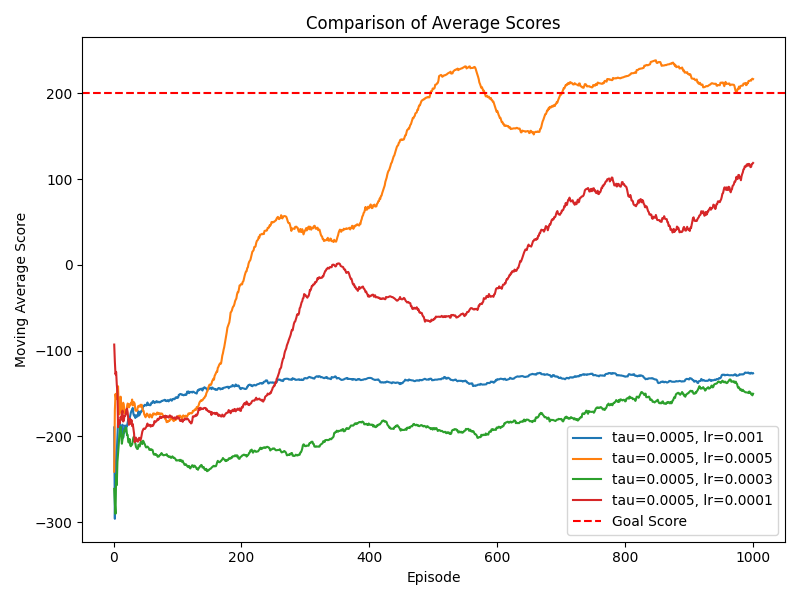
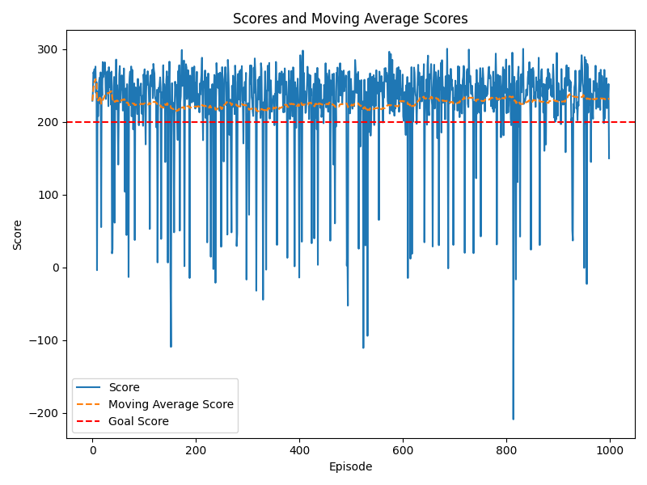

# 🚀 Lunar Lander Reinforcement Learning Project

This repository contains the implementation of a **Double Q-Learning agent** to solve the Lunar Lander problem, using the **LunarLander-v2** environment from OpenAI Gym. The agent is trained to maximize its score by landing the spaceship safely while minimizing fuel consumption. The project includes code for training, testing, and visualizing the results.

  
*An example of the agent successfully landing the spaceship.*

---

## 📑 Table of Contents

1. [Introduction](#introduction)
2. [📂 Directory Structure](#-directory-structure)
3. [💻 Installation](#-installation)
4. [🏃 How to Run](#-how-to-run)
5. [⚙️ Hyperparameter Tuning](#-hyperparameter-tuning)
6. [📊 Graphs and Results](#-graphs-and-results)
7. [🔍 Findings](#-findings)
8. [🚀 Future Work](#-future-work)
9. [📚 References](#-references)

---

## Introduction

This project implements **Double Q-Learning** to tackle the Lunar Lander challenge, where the goal is to land a spaceship safely on a designated pad. The agent is rewarded for smooth landings and penalized for crashes, inefficient fuel use, and excessive maneuvering.

The agent was trained using various hyperparameters, and the results were analyzed for performance stability, training dynamics, and convergence. The project also explores the importance of randomness and epsilon-decay strategies in determining the success of reinforcement learning agents.

---

## 📂 Directory Structure

The project directory is organized as follows:

```
├── data/          # Contains the training results (scores, metrics)
├── graphs/        # Contains plots of the training/testing performance
├── models/        # Contains saved models that achieved a score >= 200
├── DQNAgent.py    # Contains the code for the Double Q-Learning agent
├── Grapher.py     # Code to generate performance graphs from score data
├── LunarLander.py # Main file to set hyperparameters, train the agent, and save results
├── TestModel.py   # Code to evaluate saved models on test episodes
├── readme.md      # Project README
```

---

## 💻 Installation

To run this project, ensure you have **Python 3.6.2** or higher installed, and the following packages:

- `pandas`
- `re`
- `os`
- `numpy`
- `matplotlib`
- `torch`
- `gym`

You can install these packages using pip:

```bash
pip install pandas numpy matplotlib torch gym
```

---

## 🏃 How to Run

1. **Training the Agent**: To train a Double Q-Learning agent, run the `LunarLander.py` script. Hyperparameters like learning rate, epsilon decay, etc., can be tuned in this file.

    ```bash
    python LunarLander.py
    ```

    The results, including model scores, are saved in the **data/** folder, and models that achieve a score of 200 or more are saved in the **models/** folder.

2. **Generating Graphs**: To visualize the training results (score progression), run `Grapher.py`.

    ```bash
    python Grapher.py
    ```

    This will create plots in the **graphs/** folder.

3. **Evaluating Saved Models**: To evaluate a saved model, run the `TestModel.py` script. This script loads a model from the **models/** directory and evaluates it over 1000 test episodes, producing new score data in **data/**.

    ```bash
    python TestModel.py
    ```

---

## ⚙️ Hyperparameter Tuning

The key hyperparameters to tune are:

| Hyperparameter    | Description |
|-------------------|-------------|
| **Learning Rate (`lr`)** | Controls the step size in model updates. |
| **Update Rate (`τ`)** | Determines how quickly the target network weights update. |
| **Discount Factor (`γ`)** | Governs the importance of future rewards. |
| **Epsilon Decay** | Controls the exploration-exploitation balance. |

Modify these parameters in `LunarLander.py` before running the script to adjust the training behavior.

---

## 📊 Graphs and Results

Sample graphs of the model's performance over 1000 episodes:

- **Training Progression**: Moving average score over training episodes.
- **Evaluation Results**: Performance of saved models over test episodes.

Graphs are stored in the **graphs/** directory and can be generated using `Grapher.py`.

Example of a training graph:


---

## 🔍 Findings

### Key Insights from the Experimentation:

- **Optimal Hyperparameters**: The first successful model was trained with τ = 0.01, lr = 0.001, and γ = 0.99. It achieved a peak average score of 252.
  Performance graph for best model:
  
  
- **Randomness Impact**: Early exploration (high epsilon) greatly influences the agent's ability to find winning policies. Fine-tuning the epsilon-decay parameter is crucial for convergence.

- **Model Stability**: Two models achieved high scores, but their generalization differed. A model with a lower peak score (238) performed consistently in testing, while the higher-scoring model (252) showed volatility during evaluation.

For a detailed analysis, refer to the [PDF report](RL_Project_Lunar.pdf).

---

## 🚀 Future Work

- Investigate alternative strategies for epsilon-decay to improve consistency in building winning models.
- Explore more sophisticated neural network architectures and optimization techniques.
- Expand the testing framework to include more complex environments and variations of the Lunar Lander challenge.

---

## 📚 References

- OpenAI Gym: [LunarLander-v2](https://gym.openai.com/envs/LunarLander-v2/)
- Mnih et al., "Playing Atari with Deep Reinforcement Learning", 2013
- van Hasselt et al., "Deep Reinforcement Learning with Double Q-Learning", 2015

---

